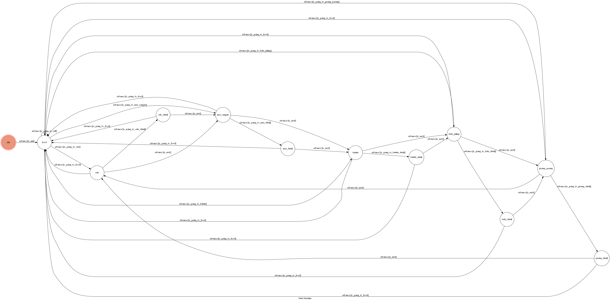
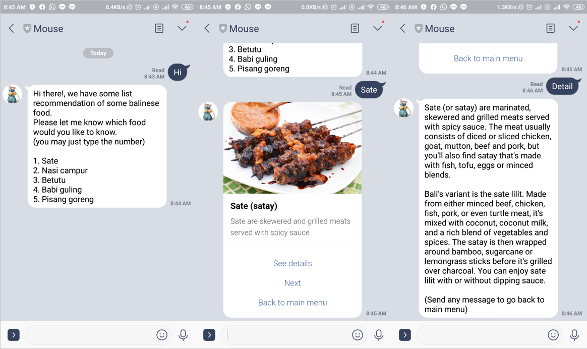
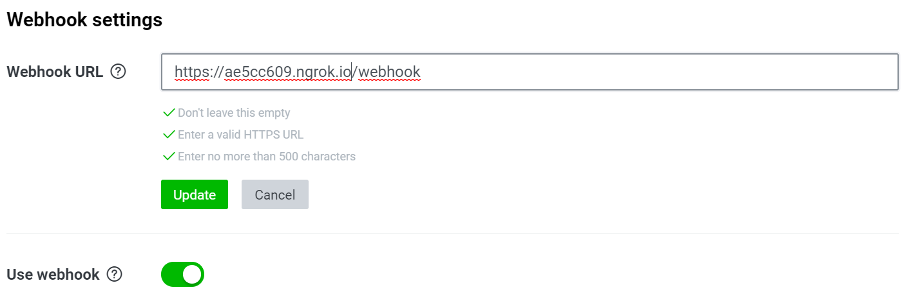
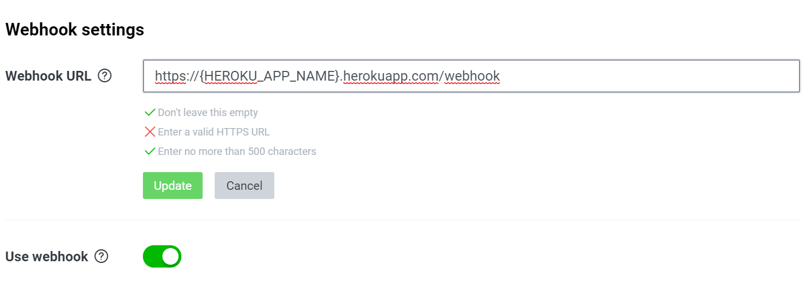

# TOC Project 2020

## Balinese Food
Hi, I am overseas chinese student from Indonesia-Bali. I would like to introduce some balinese food that I would really recommend if you go to bali and this chatbot will do exactly that!


## Finite State Machine



## Usage
The initial state is set to `init`.

To get started you can send any message to trigger `food` (main menu) state. Then you can select which food do you want to know and it will move to the corresponding state. When you send invalid message it will go back to the `food` (main menu) state.


## Example Interaction



## Setup

### a. Run Locally
You can either setup https server or using `ngrok` as a proxy.

#### Ngrok installation
- *[Download Ngrok](https://ngrok.com/download)*

**To run `Ngrok`:**

1. Run the command below

	```
	ngrok http your_port_number
	```

2. After that, `ngrok` would generate a `https` URL

	```python
	ngrok by @inconshreveable    (Ctrl+C to quit)

	Session Status                online
	Session Expires               7 hours, 59 minutes
	Version                       2.3.35
	Web Interface                 http://127.0.0.1:4040
	Forwarding                    http://ae5cc609.ngrok.io -> http://localhost:8000
	Forwarding                    https://ae5cc609.ngrok.io -> http://localhost:8000
	Connections                   ttl     opn     rt1     rt5     p50     p90
								0       0       0.00    0.00    0.00    0.00
	```

3. Copy the `https` URL and paste it in your linebot `webhook` settings

	

4. Run app.py

	* Before run app.py first set Environment Variables

		```python
		set LINE_CHANNEL_SECRET=your_line_channel_secret
		set LINE_CHANNEL_ACCESS_TOKEN=your_line_channel_access_token
		``` 

		**MUST** be set to proper values. Otherwise, you might not be able to run your code.

	* Then run app.py

		```python
		python app.py
		```

### b. Run on Heroku Server
Setting to deploy webhooks on Heroku.

#### Heroku CLI installation
* *[Heroku CLI](https://devcenter.heroku.com/articles/heroku-cli)*

#### Connect to Heroku
1. Register Heroku: https://signup.heroku.com

2. Create Heroku project from website

3. CLI Login

	```python
	heroku login
	```

#### Upload project to Heroku
1. Add local project to Heroku project

	```python
	heroku git:remote -a {HEROKU_APP_NAME}
	```

2. Upload project

	```python
	git add .
	git commit -m "commit_message"
	git push -f heroku master
	```

3. Set Environment - Line Messaging API Secret Keys

	```python
	heroku config:set LINE_CHANNEL_SECRET=your_line_channel_secret
	heroku config:set LINE_CHANNEL_ACCESS_TOKEN=your_line_channel_access_token
	```

4. Connect Line to Heroku

	```
	URL: https://{HEROKU_APP_NAME}.herokuapp.com/webhook
	````

	

	```
	Debug: heroku logs --tail --app {HEROKU_APP_NAME}
	```

5. If fail with `pygraphviz` install errors

	run commands below to solve the problems

	```python
	heroku buildpacks:set heroku/python
	heroku buildpacks:add --index 1 heroku-community/apt
	```

	
## For more details
A Line bot based on a finite state machine [Slides](https://github.com/NCKU-CCS/TOC-Project-2020) and [FAQ](https://hackmd.io/s/B1Xw7E8kN)
